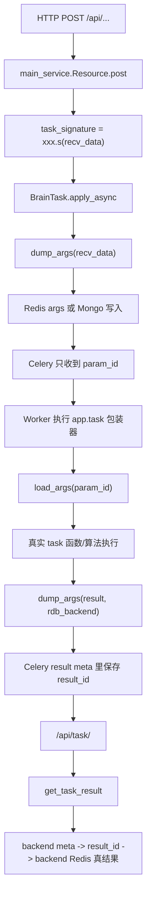

---
tags:
  - brain
  - celery
  - task-state
  - redis
  - mongo
  - refactor
status: active
updated: 2026-03-27
---

# Brain Celery 队列与任务状态存储专题

## 1. 这篇文档解决什么问题

这篇文档专门回答 `brain` 的异步任务系统到底是怎么工作的，重点不是“Celery 怎么配”，而是：

1. HTTP 请求进入后，参数被放到了哪里。
2. Celery 真正收到的消息体是什么。
3. 任务执行完成后，结果存到了哪里。
4. `/api/task/<task_id>`、`/api/task_args/<task_id>` 这些接口如何拿到数据。
5. 未来如果用其他语言重写，哪些行为契约必须保住。

## 2. 关键源码位置

核心文件：

- `/Users/jiangtao.sheng/Documents/source/mercury-brain/lib/parallel_compute/brain_celery.py`
- `/Users/jiangtao.sheng/Documents/source/mercury-brain/lib/parallel_compute/celery_config.py`
- `/Users/jiangtao.sheng/Documents/source/mercury-brain/lib/data_loader/brain_redis/celery_task_args.py`
- `/Users/jiangtao.sheng/Documents/source/mercury-brain/lib/utils/function_tools.py`
- `/Users/jiangtao.sheng/Documents/source/mercury-brain/lib/web_service/main_service.py`
- `/Users/jiangtao.sheng/Documents/source/mercury-brain/lib/utils/cfg.py`
- `/Users/jiangtao.sheng/Documents/source/mercury-brain/lib/utils/db.py`

## 3. 先给一个总览结论

`brain` 的异步任务体系不是“把整个请求 JSON 直接丢给 Celery”。

它的真实模型是：

1. API 层先把入参序列化并落到 Redis 或 Mongo。
2. Celery 消息里只传一个 `param_id`。
3. worker 执行时再用 `param_id` 回取原始参数。
4. 任务结果也不会直接原样塞回 Celery result meta，而是再次压缩后落到专门的 backend Redis。
5. 状态查询接口再通过 `task_id -> result meta -> result_id -> 真正结果` 这条链取回结果。

这意味着 `brain` 的运行时协议实际上是一个“双层存储模型”：

- 第一层：Celery broker / result backend 用于任务调度和状态元信息
- 第二层：Redis/Mongo 用于大参数、大结果的真实载荷

## 4. 请求进入后的真实生命周期

## 5. 参数是怎么落库的

### 5.1 入口点：`BrainTask.apply_async`

在 `/lib/parallel_compute/brain_celery.py` 中，自定义了 `BrainTask(Task)`。

它重写了 `apply_async`：

1. 先调用 `dump_args(args)`。
2. 获得 `param_id`。
3. 再把原始任务参数替换成只包含 `param_id` 的参数元组。

这意味着 Celery 中真正排队的不是完整请求体，而是一个轻量引用。

### 5.2 参数序列化方式

在 `/lib/data_loader/brain_redis/celery_task_args.py` 中：

- 先 `pickle.dumps(recv_data)`
- 再 `zlib.compress`
- 最后根据配置写入 Redis 或 Mongo

配置开关来自 `/lib/utils/cfg.py`：

- `celery_args_db_type`
- `args_expires`
- `args_retain_time`

### 5.3 参数存储后端

当前代码支持两种参数存储后端：

1. `redis`
2. `mongo`

对应行为：

- `redis` 模式下，参数会写入 `rdb_args`
- `mongo` 模式下，参数会写入 `brain_mongo_collection`

Mongo 还会为 `time` 字段建 TTL 索引，过期时间来自 `args_expires`。

### 5.4 大报文切片

参数写入时支持切片：

- Redis 模式通过 `batch_process`
- Mongo 模式按约 `10MB` 分片批量插入

所以 `param_id` 在实现上可能不是单个字符串，而是一个 `id list`。

这也是为什么代码里很多 `load_args` / `delete_args` 都同时兼容字符串和列表。

## 6. worker 执行时发生了什么

### 6.1 `app.task` 被二次包装

在 `/lib/parallel_compute/brain_celery.py` 中，`app.task` 并不是 Celery 原生装饰器行为，而是又包了一层：

1. 先从 `args[0]` 取出 `param_id`
2. `load_args(args[0])` 回取真实参数
3. 调用原始 task 函数
4. 将 task 返回值再次 `dump_args(..., rdb_conn=rdb_backend, expire=result_expires)`
5. 返回的是 `result_id`，不是原始结果本身
6. `finally` 中再 `delete_args(args[0], args_retain_time)`

### 6.2 这意味着什么

这意味着：

- Celery task 函数看到的是完整原始参数
- Celery backend meta 中保存的是“结果引用”
- 入参默认不会永久保留，会在执行结束后删除或延长有限保留时间

### 6.3 并行任务的特殊处理

包装器里还有一段针对并行 accumulate 任务的特殊逻辑：

- 如果发现参数结构是“子结果 ID 列表”
- 则会从 `rdb_backend` 中递归加载子任务结果

这说明并行任务之间传递的往往也不是大对象本身，而是结果引用。

## 7. 队列与路由是怎么分的

在 `/lib/parallel_compute/celery_config.py` 中，当前主要有三类队列：

- `portfolio_management`
- `parallel_parent`
- `parallel_attr`

如果开启 `split_run_mode`，则会切换为：

- `split_portfolio_management`
- `split_parallel_parent`
- `split_parallel_attr`

### 7.1 路由语义

任务路由大致是：

- `task_mom.py`、`task_old_mom.py` -> `portfolio_management`
- `parallel_parent_task.py` -> `parallel_parent`
- `parallel_algorithm_unit/parallel_tasks/*` -> `parallel_attr`

这对应了三个职责层次：

1. 普通业务任务入口
2. 并行父任务调度层
3. 并行子任务执行层

### 7.2 其他关键 Celery 配置

当前还能确认的配置包括：

- `task_serializer = 'pickle'`
- `result_serializer = 'pickle'`
- `task_compression = 'gzip'`
- `result_compression = 'gzip'`
- `task_acks_late = True`
- `worker_prefetch_multiplier = 1`
- `task_time_limit = task_time_limit`
- `result_extended = result_extended`

这些配置对重写非常重要，因为它们体现了系统对“大对象、长任务、低预取”的实际偏好。

## 8. 结果和状态是怎么查回来的

### 8.1 状态查询入口

状态查询接口在 `/lib/web_service/main_service.py`：

- `TaskStatusGet` -> `/api/task/<task_id>`
- `TaskStatusGet` -> `/status/<task_id>`

它内部调用 `/lib/utils/function_tools.py` 中的 `get_task_result(task_id)`。

### 8.2 `get_task_result` 的真实逻辑

`get_task_result` 并没有直接走标准 `AsyncResult().get()`。

它的逻辑是：

1. 直接从 `celery_app.backend.get(celery_app.backend.get_key_for_task(task_id))` 拿 meta
2. 如果没有 meta，返回 `PENDING`
3. 如果有 meta，则 `decode_result(meta)`
4. 取出 `status` 和 `result`
5. 如果 `result` 是一个列表，视为 `result_id list`，再调用 `load_args(..., rdb_conn=rdb_backend)` 取真结果
6. 如果 `result` 是一个 dict，且内部 `result.task_id` 存在，则递归追踪嵌套任务结果

### 8.3 对外暴露的状态模型

代码内部的 Celery 状态会被再次包装成对外接口状态：

- 若 Celery 状态是 `SUCCESS` / `FAILURE`，接口统一返回 `state = FINISH`
- 若没有完成，则直接透传 `PENDING`、`STARTED` 等状态

所以前端或上层服务看到的并不是纯 Celery 原始状态集，而是一个简化过的状态协议。

## 9. 任务取消与参数回溯

### 9.1 取消接口

取消接口：

- `/api/task/cancel/<task_id>`

实现逻辑在 `TaskCancel.delete`：

1. 如果 `result_extended = True`
2. 通过 `app.AsyncResult(task_id)` 取 task 元信息
3. 尝试读 `task.args[0]` 拿到 `param_id`
4. 先 `delete_args(recv_data)`
5. 再 `app.control.terminate(task_id)`

如果 `result_extended = False`，则只能终止任务，无法安全删除对应参数。

### 9.2 参数回溯接口

入参回溯接口有两个：

- `/api/task_args/<task_id>`
- `/api/task_args_mongo/<task_id>`

本质上都是：

1. 先 `AsyncResult(task_id)`
2. 从 `task.args[0]` 找到 `param_id`
3. 再分别走 `load_args` 或 `load_args_mongo`

这说明“可回看请求体”并不是 Celery 自带功能，而是这个系统自建的参数引用体系的一部分。

## 10. 当前已确认的外部依赖

### 10.1 运行时依赖

- Celery
- broker
- result backend
- Redis args 库
- Redis backend 库
- Mongo（可选）

### 10.2 配置依赖

主要来自 `/lib/utils/cfg.py`：

- `broker_url`
- `backend_url`
- `broker_transport_options`
- `result_backend_transport_options`
- `redis_args_*`
- `redis_backend_*`
- `brain_mongo_*`
- `result_expires`
- `args_expires`
- `args_retain_time`
- `task_time_limit`
- `split_run_mode`

## 11. 对未来重构最重要的稳定契约

如果未来把这套系统重写成其他语言，我认为以下契约比“继续用 Celery”更重要。

### 11.1 契约一：任务请求与任务载荷解耦

需要保住“消息队列只传引用，不传大对象”的设计思想。

否则：

- broker 负载会明显变重
- 大 JSON / 大 DataFrame 序列化会成为稳定性瓶颈
- 任务重试和回溯能力也会变差

### 11.2 契约二：任务状态与真实结果解耦

需要保住“状态元信息”和“真实结果载荷”分层存储。

否则：

- 结果过大时 result backend 会很脆弱
- 并行子任务聚合链会很难做

### 11.3 契约三：任务可追踪、可取消、可回看参数

当前系统已经默认具备：

- 查询状态
- 查询结果
- 查询入参
- 取消任务

未来即使不继续使用 Celery，这四类能力也应视为对外稳定接口能力。

### 11.4 契约四：并行子任务之间允许传“结果引用”

当前并行任务链大量依赖“子结果先落后端，再传结果 ID”。

如果重写时直接把子任务结果嵌入父任务消息，架构特征就会完全变掉。

## 12. 待确认项

以下是目前从源码看得到、但还未完全通过运行验证的点：

1. `backend_url` 在配置层理论上支持 `redis`、`sentinel`、`amqp` 等形式，但 `get_task_result` 使用了非常明显的 KV backend 读取方式，因此生产主链大概率依赖 Redis 风格 backend。
2. `TaskCancel` 调用的是 `app.control.terminate(task_id)`，这更像直接终止 worker 执行，而不是标准的 `revoke(terminate=True)` 封装，后续如要精确复刻，建议结合运行环境再核一次。
3. `result_extended` 为真时，系统会依赖 task meta 中能取到 `args`，这一点属于当前 Celery 配置与 backend 能力共同决定的实现细节。

## 13. 一句话结论

`brain` 的异步体系本质上不是“一个 Celery 服务”，而是“任务编排层 + 参数/结果对象存储层 + 状态查询协议层”的组合体；未来重构时，真正要保住的是这套运行时契约，而不是某个具体 Python 框架。
