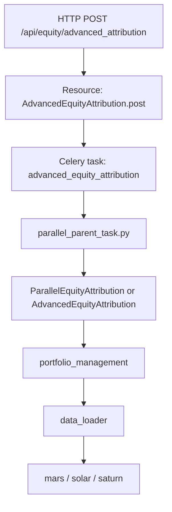

---
tags:
  - brain
  - celery
  - task
  - orchestration
  - refactor
status: draft
updated: 2026-03-27
---

# Brain 任务编排与执行链

## 1. 任务编排层的位置

`brain` 的任务编排核心位于：

- `/Users/jiangtao.sheng/Documents/source/mercury-brain/lib/parallel_compute`

其中最重要的文件包括：

- `brain_celery.py`
- `tasks/task_mom.py`
- `tasks/task_old_mom.py`
- `tasks/parallel_parent_task.py`

## 2. API 到任务的基本模式

在 `main_service.py` 中，大多数 Resource 都是以下模式：

1. 读取请求 JSON
2. 构造任务签名 `xxx.s(recv_data)`
3. `apply_async(...)`
4. 返回 `task_id`

这意味着：

- API 层只负责触发计算
- 任务层才是业务执行入口

## 3. 主要任务入口文件

### 3.1 `task_mom.py`

定位：

- 普通分析任务入口

特点：

- 大量业务接口都由这里承接
- 几乎每个 Celery task 都只是：
  - 构造一个 `Analysis/Calculator` 对象
  - 调 `get_task_result()`
  - 返回 `task_result.get()`

这说明：

- `task_mom.py` 更像“算法单元适配器”

### 3.2 `task_old_mom.py`

定位：

- 历史保留的旧任务入口

说明：

- 当前系统存在新老任务链并存

### 3.3 `parallel_parent_task.py`

定位：

- 新版并行归因父任务入口

特点：

- 债券、股票、混合资产新版归因从这里进入
- 根据 `use_parallel` 决定走并行实现还是串行实现

## 4. `parallel_parent_task.py` 的意义

这个文件非常关键，因为它体现了 `brain` 对“新归因链”的统一调度方式。

以股票归因为例：

- `advanced_equity_attribution`
- `equity_attribution_trend`
- `equity_invest_style_attribution`
- `normalized_advanced_equity_attribution`

这里的模式是：

1. 根据配置选择并行或串行 calculator
2. calculator 输出 `task_result`
3. 返回 `task_result.get()`

这说明：

- Resource 层不感知并行/串行
- 任务父层负责计算实现选择

## 5. 当前配置如何决定执行实现

配置文件：

- `/Users/jiangtao.sheng/Documents/source/mercury-brain/lib/utils/cfg.py`

关键开关：

- `use_parallel`
- `parallel_process_num`
- `default_process_num`

这说明：

- 执行实现是服务端配置驱动
- 而不是 API 入参驱动

## 6. 以 `advanced_equity_attribution` 为例的执行链

## 7. 并行算法内部又如何分层

以股票归因为例：

- 父任务：`parallel_parent_task.py`
- 并行实现类：`portfolio_management/parallel_algorithm_unit/optimized/equity_parallel.py`
- 子任务：`portfolio_management/parallel_algorithm_unit/parallel_tasks/equity.py`

特点：

1. 父任务只负责选择实现
2. 并行类负责切分时间段
3. 子任务负责实际加载数据和执行算法
4. 最后再做聚合任务

这说明：

- `brain` 的“并行”不是框架自动并发，而是业务层显式拆分任务

## 8. 任务状态与结果查询

API 层提供：

- `/api/task/<task_id>`
- `/status/<task_id>`
- `/api/task/cancel/<task_id>`
- `/api/task_args/<task_id>`
- `/api/task_args_mongo/<task_id>`

这表示 `brain` 任务系统至少支持：

- 查询状态
- 查询结果
- 查询入参
- 取消任务

这也是为什么 `brain` 更像“计算平台”，而不只是接口集合。

## 9. 任务编排层的设计特征

### 9.1 Task 函数极薄

大多数 task 都是适配器，不是算法本体。

### 9.2 任务命名与 API 语义强耦合

例如：

- Resource `AdvancedEquityAttribution`
- task `advanced_equity_attribution`

这降低了阅读成本，但也让 API 层和执行层耦合较深。

### 9.3 新旧链共存

存在：

- `task_old_mom.py`
- `task_mom.py`
- `parallel_parent_task.py`

这说明系统在演进过程中没有统一迁移，而是分层叠加。

## 10. 重构建议

建议未来把任务层抽成 3 层：

### 10.1 API Trigger Layer

- 负责把 HTTP 请求转成 Job Request

### 10.2 Job Orchestrator Layer

- 负责选择执行实现
- 负责并行切分

### 10.3 Algorithm Executor Layer

- 负责真正计算

这样可以把当前混杂在 task 文件中的职责拆清楚。

## 11. 一句话结论

`brain` 的任务编排层是整个系统的中枢胶水层，它连接了 API、数据加载和算法执行，是未来重构时最值得优先显式建模的一层。
