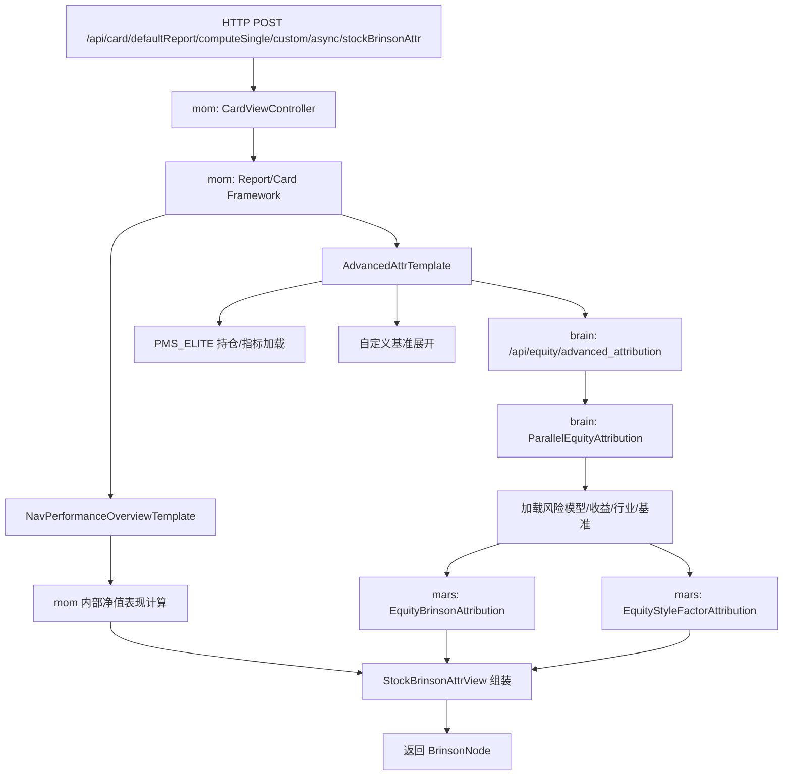

---
tags:
  - mom
  - brain
  - mars
  - pms
  - attribution
  - brinson
  - refactor
status: draft
updated: 2026-03-27
---

# stockBrinsonAttr 全链路拆解

## 1. 这份文档的用途

这份文档用于沉淀 `mom` 接口 `stockBrinsonAttr` 的完整执行链路，目标不是排查某一次请求，而是为后续系统重构和异语言重写提供稳定的知识底稿。

相关索引页：

- [系统重构知识库 MOC](./系统重构知识库-MOC.md)

本文重点回答 6 个问题：

1. HTTP 请求是如何进入 `mom` 的。
2. `stockBrinsonAttr` 在 `mom` 中究竟是一个什么能力。
3. `mom` 分别依赖了哪些下游服务。
4. `brain` 和 `mars` 各自承担什么职责。
5. 这条链路依赖了哪些外部数据和底层存储。
6. 如果要重写，边界应该怎样切。

## 2. 待分析接口

接口示例：

```bash
curl -X POST \
  'http://localhost:8090/api/card/defaultReport/computeSingle/custom/async/stockBrinsonAttr?debug=true' \
  -H 'Content-Type: application/json' \
  -H 'DatayesPrincipalName: jiangduo.song@datayes.com' \
  -d '{
    "startDate": "2025-01-01",
    "endDate": "2025-01-17",
    "accountId": "e61a918726ae4aac945eac7dca5ed002",
    "customParamMap": {
        "industryType": "SW21_1",
        "aiStock": true,
        "withFofReportDate": false,
        "moneyFundPenetrate": true
    },
    "benchmark": {
        "composition": [
            {
                "id": 1782,
                "weight": 1,
                "calType": 100,
                "name": "沪深300",
                "quotedMargin": 0
            }
        ],
        "id": null
    },
    "rebalancePeriod": 1,
    "accountDataFrom": "PMS_ELITE",
    "riskFreeRate": 0.03,
    "templateType": "PMS_ELITE_PORTFOLIO",
    "category": "E"
}'
```

## 3. 一句话结论

`stockBrinsonAttr` 不是一个独立的算法服务接口，而是 `mom` 卡片框架下的一个“结果组装点”。

它的核心流程是：

1. 在 `mom` 中准备组合持仓、基准、日期和展示参数。
2. 在 `mom` 中计算净值表现摘要 `NavPerformanceOverview`。
3. 在 `mom` 中调用 `brain` 的高级股票归因接口获取 `AdvancedAttr`。
4. 在 `brain` 中加载风险模型、收益、行业、基准等数据。
5. 在 `mars` 中完成 Brinson 归因和风格因子归因计算。
6. 回到 `mom`，将 `AdvancedAttr` 和净值表现拼成最终的 `BrinsonNode` 树结构返回前端。

## 4. 系统边界

当前工作区根目录只是几个源码目录的软链接：

- `mom -> /Users/jiangtao.sheng/Documents/source/mom-robo`
- `brain -> /Users/jiangtao.sheng/Documents/source/mercury-brain`
- `mars -> /Users/jiangtao.sheng/Documents/source/mars`
- `pms -> /Users/jiangtao.sheng/Documents/source/mercury-pms-elite`
- `solar -> /Users/jiangtao.sheng/Documents/source/solar`
- `saturn -> /Users/jiangtao.sheng/Documents/source/saturn`

为了便于后续排查，本文统一按这四层理解系统：

- `mom`：业务入口、报表卡片框架、参数归一化、数据准备、结果组装。
- `pms`：组合持仓、穿透、虚母虚子、指标计算。
- `brain`：归因任务编排、归因所需数据加载。
- `mars`：归因算法核心。

## 5. 总体链路图



## 6. mom 链路

### 6.1 HTTP 入口

入口位于：

- `mom/mom-web/src/main/java/com/datayes/web/mom/card/CardViewController.java`

关键方法：

- `computeSingleDefaultCardAsync`

关键行为：

1. 接收 `ReportParam`。
2. 将 `debug` 写回请求参数。
3. 读取当前 `accountId` 的 `idVersion`。
4. 调 `reportService.getCustomDefaultParamWithoutCache(...)` 补齐默认参数。
5. 注入用户、租户、角色、`cardKey`、`idVersion`。
6. 通过 `reportManager.getSingleCardReport(param, cardKey)` 构造单卡片报表。
7. 调 `computeAndLoad(cardKey, false)` 触发卡片计算。
8. 将 `cardResult` 和 `accountInfo` 一起返回。

代码位置：

- `/Users/jiangtao.sheng/Documents/demo/codex-mof/mom/mom-web/src/main/java/com/datayes/web/mom/card/CardViewController.java:355`

### 6.2 stockBrinsonAttr 的真实含义

`stockBrinsonAttr` 不是单独 controller，也不是一段独立 service 逻辑，而是一个卡片视图定义。

定义位置：

- `/Users/jiangtao.sheng/Documents/demo/codex-mof/mom/mom-web/src/main/java/com/datayes/web/mom/service/card/cardTemplate/equity/view/StockBrinsonAttrView.java:64`

核心代码语义：

```java
@CardView(...)
public BrinsonNode getStockBrinsonAttr(
    @CardTplResult(NavPerformanceOverviewTemplate.class) BenchmarkNavPerformanceOverview npo,
    @CardTplResult(AdvancedAttrTemplate.class) AdvancedAttr advancedAttr
) {
    return BrinsonNode.generateTree(advancedAttr, npo.getPortfolio());
}
```

这说明：

- 这个卡片依赖两个模板结果。
- 这个卡片自己不计算归因，也不计算净值。
- 它只是把“净值表现”和“归因结果”拼成最终树形返回值。

### 6.3 子链路 A：净值表现

模板位置：

- `/Users/jiangtao.sheng/Documents/demo/codex-mof/mom/mom-web/src/main/java/com/datayes/web/mom/service/card/cardTemplate/common/NavPerformanceOverviewTemplate.java:88`

这条链路的特点：

- 不走 `brain` 的 `/api/equity/advanced_attribution`。
- 在 `mom` 内部通过 `JBrainNavPerfComputerAdapter` 和本地 loader 体系完成计算。
- 产出的是组合和基准的净值表现摘要。

主要产物包括：

- 组合累计收益
- 基准累计收益
- 超额收益
- 相关性
- 胜率
- 盈亏比
- 累计收益序列

对 `stockBrinsonAttr` 的作用：

- 最终返回树中使用的是 `npo.getPortfolio()`。
- 这意味着前端看到的 Brinson 卡片并不仅仅是归因结果，还带有净值表现语义。

### 6.4 子链路 B：高级股票归因

模板位置：

- `/Users/jiangtao.sheng/Documents/demo/codex-mof/mom/mom-web/src/main/java/com/datayes/web/mom/service/card/cardTemplate/common/AdvancedAttrTemplate.java:89`

这条链路是整个接口中最核心的业务链。

主要步骤：

1. 先 clone `ReportParam` 并按产品类型调整采样频率。
2. 构造 `PositionWithBenchmarkPost`。
3. 若无股票持仓则直接失败。
4. 解析行业分类参数 `industryType`。
5. 解析风险模型参数 `riskModelVersion`。
6. 复制为 `IndustryPositionBenchmarkPost`。
7. 填充：
   - `industryCategory`
   - `industryLevel`
   - `modelVersion`
8. 如果账户类别是混合型 `H`，则设置 `normalized=true`。
9. 如果 `accountDataFrom=PMS_ELITE`，则对持仓按交易日做对齐。
10. 扩展自定义基准持仓。
11. 调 `commonAttributionRptService.getAdvancedAttr(p)` 发起 `mom -> brain` 调用。

### 6.5 mom 到 brain 的 RPC

RPC 声明位置：

- `/Users/jiangtao.sheng/Documents/demo/codex-mof/mom/mom-web/src/main/java/com/datayes/web/mom/service/card/attr/CommonAttributionRptService.java:191`

对应接口：

- `POST /api/equity/advanced_attribution`

这就是 `stockBrinsonAttr` 在跨服务意义上最关键的一跳。

## 7. mom 对 PMS 的依赖链

### 7.1 为什么要看 PMS

用户请求里传了：

- `accountDataFrom: PMS_ELITE`
- `withFofReportDate: false`
- `moneyFundPenetrate: true`

这意味着 `mom` 不会自己直接从数据库拼持仓，而是走 `PMS_ELITE` 相关 loader。

### 7.2 mom 内部的 PMS 装配点

主要位置：

- `/Users/jiangtao.sheng/Documents/demo/codex-mof/mom/mom-web/src/main/java/com/datayes/web/mom/service/card/loader/CardAttrPostHelper.java:332`
- `/Users/jiangtao.sheng/Documents/demo/codex-mof/mom/mom-web/src/main/java/com/datayes/web/mom/service/card/loader/PmsEliteCardPostLoader.java:77`
- `/Users/jiangtao.sheng/Documents/demo/codex-mof/mom/mom-web/src/main/java/com/datayes/web/mom/service/card/loader/position/pmselite/PmsEliteAccountPositionLoader.java:92`

职责拆分如下：

- `CardAttrPostHelper`：构造 `PositionWithBenchmarkPost`。
- `PmsEliteCardPostLoader`：加载持仓以及穿透涉及到的子产品净值。
- `PmsEliteAccountPositionLoader`：真正调用 PMS 接口并将结果压平为 `DailyPosition`。

### 7.3 mom 实际向 PMS 请求了什么

`PmsEliteAccountPositionLoader` 中最关键的是两类调用：

1. 持仓查询：
   - `pmsPositionLoader.positionComposition(...)`
2. 指标查询：
   - `indicatorLoaderProxy.loadIndicators(...)`

其中 `loadIndicators(...)` 会读取 `netAsset`，用于把持仓转换成权重。

位置：

- `/Users/jiangtao.sheng/Documents/demo/codex-mof/mom/mom-web/src/main/java/com/datayes/web/mom/service/card/loader/position/pmselite/PmsEliteAccountPositionLoader.java:276`
- `/Users/jiangtao.sheng/Documents/demo/codex-mof/mom/mom-web/src/main/java/com/datayes/web/mom/service/card/loader/position/pmselite/PmsEliteAccountPositionLoader.java:348`

### 7.4 PMS 持仓接口的真实实现

在 `pms` 中，持仓接口入口位于：

- `/Users/jiangtao.sheng/Documents/source/mercury-pms-elite/lib/api/position/views.py:34`

服务层：

- `/Users/jiangtao.sheng/Documents/source/mercury-pms-elite/lib/controller/position_service.py:40`

核心计算：

- `/Users/jiangtao.sheng/Documents/source/mercury-pms-elite/lib/controller/position/position_composition.py:146`

请求参数定义：

- `/Users/jiangtao.sheng/Documents/source/mercury-pms-elite/lib/api/standard_input/position_args.py:35`

关键结论：

- 这是一个 GET 风格的持仓查询接口。
- 它支持：
  - `mom_perspective`
  - `perspective_display`
  - `is_original`
  - `security_types`
  - `realtime_computation`
  - `real_all_data`
  - `real_time_quote`
  - `merge_hke`
  - `fof_perspective_method`
  - `fof_perspective_display`
  - `with_fof_report_date`
- 所以 `mom` 里的穿透相关参数，确实会持续传导进 `pms` 的持仓计算逻辑。

### 7.5 PMS 持仓接口内部在做什么

`position_composition.py` 的核心行为不是简单查一张表，而是：

1. 从 Mongo 读取：
   - `POSITION`
   - `CASH`
2. 通过 `MomData` 和 `MOM` 处理：
   - 多层组合
   - 虚母虚子
   - MOM 视角穿透
   - 层级展示
3. 如果打开 `real_time_quote`，则做实时估值。
4. 最终输出层级持仓结构。

因此，`PMS_ELITE` 在这条链路中不是“原始数据源”，而是一个已经带有较强业务语义的组合计算服务。

### 7.6 PMS 指标接口的真实实现

在 `pms` 中，指标接口入口位于：

- `/Users/jiangtao.sheng/Documents/source/mercury-pms-elite/lib/api/portfolio/indicator/views.py:35`

服务层：

- `/Users/jiangtao.sheng/Documents/source/mercury-pms-elite/lib/controller/indicator_service.py:36`

核心计算：

- `/Users/jiangtao.sheng/Documents/source/mercury-pms-elite/lib/business/indicator/indicator_calculation.py:41`

关键结论：

- 这条接口不是再去调别的微服务拼净资产。
- 它先查 Mongo 中的：
  - `INDICATOR`
  - `DEDUCE_INDICATOR`
- 然后通过 `get_portfolio_summary_values(...)` 补算：
  - `nav`
  - `share`
  - `net_asset`
  - 其他摘要指标

对 `mom` 的意义：

- `mom` 使用该接口拿 `netAsset`，再将层级持仓换算为占净值比权重。

### 7.7 PMS 还依赖什么底层数据

`pms` 的配置中直接声明了 Mongo 和 Redis：

- `/Users/jiangtao.sheng/Documents/source/mercury-pms-elite/etc/pms.cfg:34`
- `/Users/jiangtao.sheng/Documents/source/mercury-pms-elite/etc/pms.cfg:41`

同时 `pms` 内部还通过 `data_sdk` 接各类底层数据接口，包括：

- 股票：`lib/db/stock_api.py`
- 基金：`lib/db/fund_api.py`
- 债券：`lib/db/bond_api.py`
- 私有资产：`lib/db/private_asset_api.py`
- 组合：`lib/db/portfolio_api.py`
- 汇率：`lib/db/fx_rate_api.py`
- 行情：`lib/db/md_api.py`

额外说明：

- `DataPortal` 还会组织 `MarketService`、`AssetService`、`UniverseService`、`PortfolioService`、`BehaviorService` 等内部数据服务。
- 如果开启 `real_time_quote`，还会走最新行情和场外基金预测估值。

## 8. 基准处理链

基准处理在 `mom` 里分两层：

### 8.1 普通基准

由 `benchmarkIndexComponent.loadComposition(...)` 构造。

位置：

- `/Users/jiangtao.sheng/Documents/demo/codex-mof/mom/mom-web/src/main/java/com/datayes/web/mom/service/card/loader/CardAttrPostHelper.java:339`

### 8.2 自定义基准

由 `CustomIndexCompositionHoldingService` 展开为逐日持仓。

位置：

- `/Users/jiangtao.sheng/Documents/demo/codex-mof/mom/mom-web/src/main/java/com/datayes/benchmark/supporter/impl/CustomIndexCompositionHoldingService.java:84`

它依赖：

- `UserDefineIndexService`
- `UserDefinedIndexCompositionService`
- `ISecurityCache`

结论：

- 对 `brain` 来说，收到的 benchmark 可能不只是指数 id，也可能已经被 `mom` 展开成一段自定义持仓时间序列。

## 9. brain 链路

### 9.1 brain 的 HTTP 入口

位置：

- `/Users/jiangtao.sheng/Documents/demo/codex-mof/brain/lib/web_service/main_service.py:1338`

关键语义：

- `POST /api/equity/advanced_attribution`
- 不直接计算结果
- 只创建 Celery 任务并返回 `task_id`

### 9.2 串行还是并行

任务分发位置：

- `/Users/jiangtao.sheng/Documents/demo/codex-mof/brain/lib/parallel_compute/tasks/parallel_parent_task.py:85`

配置位置：

- `/Users/jiangtao.sheng/Documents/demo/codex-mof/brain/etc/brain.conf:84`

结论：

- 当前配置 `use_parallel=True`
- 因此这条主链实际走的是 `ParallelEquityAttribution`
- 不是串行版 `AdvancedEquityAttribution`

### 9.3 并行归因主流程

位置：

- `/Users/jiangtao.sheng/Documents/demo/codex-mof/brain/lib/portfolio_management/parallel_algorithm_unit/optimized/equity_parallel.py:128`

这里主要完成：

1. 解析请求中的组合持仓和基准持仓。
2. 规范行业分类参数。
3. 将交易日切分为多个分组。
4. 每组交易日提交一个子任务。
5. 聚合子任务结果。

### 9.4 子任务加载的数据

位置：

- `/Users/jiangtao.sheng/Documents/demo/codex-mof/brain/lib/portfolio_management/parallel_algorithm_unit/parallel_tasks/equity.py:137`

子任务会加载：

1. 基准持仓：
   - `bm.composite_holding_weight(...)`
2. 风险模型暴露：
   - `rm.get_exposure_by_tds(...)`
3. 因子协方差：
   - `rm.get_factor_covariance_by_tds(...)`
4. 特质风险：
   - `rm.get_specific_risk_by_tds(...)`
5. 股票收益：
   - `stock.get_stock_return(...)`
6. 因子收益：
   - `rm.get_factor_return(...)`
7. 股票行业：
   - `stock.get_stock_industry(...)`

这是重写时最应该保留的一份“算法输入清单”。

## 10. brain 的底层数据依赖

### 10.1 风险模型

风险模型入口模块：

- `/Users/jiangtao.sheng/Documents/demo/codex-mof/brain/lib/data_loader/risk_model.py`

它的股票风险模型实现主要代理到：

- `lib.data_loader.brain_redis.risk_model`

含义：

- 曝露矩阵
- 因子协方差
- 特质风险
- 因子收益

主要来自 `brain` 侧 Redis 风险模型缓存。

### 10.2 股票收益与行业

入口模块：

- `/Users/jiangtao.sheng/Documents/demo/codex-mof/brain/lib/data_loader/brain_redis/stock.py`

关键事实：

- `get_stock_return(...)` 读取 Redis 中的股票收益序列。
- `get_stock_industry(...)` 读取 Redis 中的行业分类数据。
- 对 `SW21` 港股场景还会额外调用 MySQL loader 补行业。

### 10.3 基准持仓

入口模块：

- `/Users/jiangtao.sheng/Documents/demo/codex-mof/brain/lib/data_loader/benchmark.py`

关键事实：

- 标准指数持仓可能来自 Redis，也可能回退到 MySQL/Oracle loader。
- 如果 benchmark 已经由 `mom` 展开为 holdings，则 `brain` 会直接消费这些逐日成分权重。

### 10.4 配置层

配置解析位置：

- `/Users/jiangtao.sheng/Documents/demo/codex-mof/brain/lib/utils/cfg.py:235`

可见 `brain` 至少显式依赖：

- MySQL
- Oracle
- Redis
- Mongo
- Celery broker/backend

## 11. mars 链路

算法文件位置：

- `/Users/jiangtao.sheng/Documents/demo/codex-mof/mars/mars/attribution/holding/equity_attribution.py`

主类：

- `EquityBrinsonAttribution`
- `EquityStyleFactorAttribution`

这层的职责是：

- 把输入的组合权重、基准权重、收益、行业、风险模型等数据，转成归因结果。

它不是数据服务层，也不是业务编排层，而是纯算法核心。

但要注意：

- `mars` 依赖 `solar.*`
- `mars` 依赖 `saturn.*`

因此如果要异语言重写，不能只移植 `mars` 里一个类名相似的实现，而要同时确认：

- 校验逻辑
- linking 逻辑
- 风险相关数学工具
- 组合模拟相关辅助逻辑

## 12. 参数语义沉淀

### 12.1 `industryType`

示例值：

- `SW21_1`

在 `mom` 中会被解析成：

- `industryCategory = SW21`
- `industryLevel = 1`

进入 `brain` 后又会进一步拆成：

- `industry_type = SW`
- `industry_version = 21`
- `industry_level = 1`

结论：

- 这是一个会真正影响算法口径的参数。

### 12.2 `riskModelVersion`

现象：

- `mom` 中确实将其写入 `modelVersion`。
- 但在 `brain` 主链中搜索 `riskModelVersion|modelVersion|cne5|cne6`，没有发现该参数被实际消费。

结论：

- 当前代码看起来存在“参数传入但未真正生效”的可能。
- 实际风险模型选择更像由 `brain` 服务端配置决定，而不是请求参数决定。

这是一条非常重要的重构注意事项：

- 未来重写时不能直接假设“请求里传了模型版本，就一定会影响结果”。

### 12.3 `normalized`

现象：

- 只有账户类别为混合型 `H` 时才会自动设置 `normalized=true`。
- 当前示例中 `category = E`，通常不会触发归一。

### 12.4 `withFofReportDate`

现象：

- 这是 PMS 侧穿透持仓查询的真实参数。
- 会一路传导到 `pms` 的 `position_composition` 逻辑。

### 12.5 `moneyFundPenetrate`

现象：

- 也是 PMS 持仓查询参数。
- 会影响穿透口径。

### 12.6 `aiStock`

现象：

- 在 `mom` 中能看到这个参数被拦截器回显。
- 在 `stockBrinsonAttr -> brain -> mars` 主链中，暂未发现它进入归因计算主流程。

结论：

- 目前更像是其他卡片或 legacy 逻辑相关参数。
- 对这条主链来说，至少当前没有证据表明它影响归因结果。

## 13. 外部依赖清单

### 13.1 跨服务依赖

这条链路明确依赖的下游服务包括：

1. `PMS_ELITE` 持仓接口
2. `PMS_ELITE` 指标接口
3. `brain` 高级股票归因接口

### 13.2 服务内部底层依赖

#### mom

- 基准服务
- 自定义指数服务
- 账户缓存
- 报表/卡片框架

#### pms

- Mongo
- Redis
- data_sdk
- 行情与估值接口
- 组合/资产/行为/汇率等内部数据服务

#### brain

- Redis 风险模型与股票收益缓存
- MySQL/Oracle benchmark loader
- Celery
- Mongo

#### mars

- `solar`
- `saturn`

## 14. 重构时建议的分层方案

如果要异语言重写，建议不要按当前仓库边界 1:1 翻译，而是按职责重构为以下 5 层：

### 14.1 Request Normalizer

职责：

- 统一解析请求参数
- 归一化行业分类、日期区间、基准定义、穿透口径

输入：

- 原始 HTTP body

输出：

- 标准化的领域请求对象

### 14.2 Portfolio / Benchmark Builder

职责：

- 加载组合持仓
- 加载净资产和指标
- 生成占净值比权重
- 展开自定义基准
- 对齐交易日

对应当前系统中的主要来源：

- `mom`
- `pms`

### 14.3 Attribution Data Loader

职责：

- 按交易日加载：
  - 股票收益
  - 行业分类
  - 因子收益
  - 风险模型暴露
  - 因子协方差
  - 特质风险

对应当前系统中的主要来源：

- `brain`

### 14.4 Attribution Engine

职责：

- 纯算法计算

对应当前系统中的主要来源：

- `mars`

### 14.5 View Assembler

职责：

- 将净值表现和归因结果拼成前端需要的树形结构

对应当前系统中的主要来源：

- `mom`

## 15. 当前最重要的风险点

### 15.1 风险模型版本参数可能未生效

这是目前最值得优先复核的问题。

原因：

- 上游请求传了 `riskModelVersion`
- `mom` 也写入了 `modelVersion`
- 但 `brain` 主链没有明显消费点

如果未来重写错误地把它当成强语义参数，可能会复刻一个“看似兼容、实则改变行为”的系统。

### 15.2 PMS 不是简单原始数据服务

`PMS_ELITE` 自身已经包含：

- 穿透
- 虚母虚子处理
- 指标补算
- 实时估值

这意味着重写时如果只保留“持仓表查询”，大概率会丢失业务口径。

### 15.3 最终返回值包含展示层语义

`stockBrinsonAttr` 的最终返回不是纯算法结果，而是展示树。

所以重构时建议将：

- 算法输出
- 展示模型

分离建模。

## 16. 建议继续补充的后续主题

这份文档已经足够作为第一版重构底稿，但为了形成完整知识库，建议后续再补 4 个专题：

1. [NavPerformanceOverviewTemplate 净值表现链路专题](./NavPerformanceOverviewTemplate-净值表现链路专题.md)
2. [PMS_ELITE 穿透持仓与指标口径专题](./PMS_ELITE-穿透持仓与指标口径专题.md)
3. `brain` 风险模型数据来源与更新链路专题
4. `mars/solar/saturn` 归因数学实现专题

## 17. 最终结论

`stockBrinsonAttr` 的本质可以概括为：

- `mom` 负责接请求、补参数、准备组合与基准、组装结果。
- `pms` 负责提供带业务口径的组合持仓和指标。
- `brain` 负责加载归因所需数据并组织任务。
- `mars` 负责执行 Brinson 和风格因子归因算法。

如果后续要重写，建议优先保住以下 3 个契约：

1. `PMS -> 标准化组合持仓/权重` 的契约
2. `brain -> 算法输入数据集` 的契约
3. `mom -> 前端展示树` 的契约

只要这 3 个契约被清晰建模，重构就能从“翻译代码”升级为“重建系统”。
