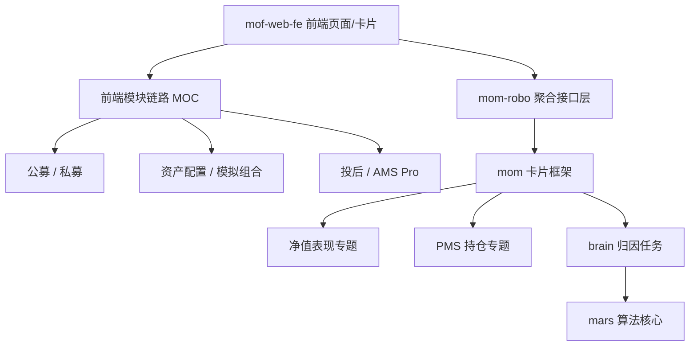

---
tags:
  - moc
  - knowledge-base
  - refactor
status: active
updated: 2026-03-31
---

# 系统重构知识库 MOC

## 1. 目标

这组文档用于为后续系统重构提供长期可维护的知识底稿。

设计原则：

- 不只记录“代码在哪”，而是记录“职责边界是什么”。
- 不只记录“当前怎么跑”，也记录“未来重写时哪些契约必须保住”。
- 每篇文档尽量只回答一个核心问题，避免形成难维护的大杂烩。

## 2. 当前目录结构

### 2.1 总览文档

- [stockBrinsonAttr 全链路拆解](./stockBrinsonAttr-全链路拆解.md)

### 2.2 专题文档

- [NavPerformanceOverviewTemplate 净值表现链路专题](./NavPerformanceOverviewTemplate-净值表现链路专题.md)
- [PMS_ELITE 穿透持仓与指标口径专题](./PMS_ELITE-穿透持仓与指标口径专题.md)
- [前端模块链路 MOC](./前端模块链路/前端模块链路-MOC.md)
- [Mom-Robo 接口知识库 MOC](./mom-robo/Mom-Robo-接口知识库-MOC.md)
- [Mof-Web-Fe 接口知识库 MOC](./mof-web-fe/Mof-Web-Fe-接口知识库-MOC.md)
- [PMS_ELITE 接口知识库 MOC](./pms-elite/PMS_ELITE-接口知识库-MOC.md)
- [Brain 接口知识库 MOC](./brain/Brain-接口知识库-MOC.md)

## 3. 推荐阅读顺序

### 3.1 如果目标是理解单条接口链路

1. [stockBrinsonAttr 全链路拆解](./stockBrinsonAttr-全链路拆解.md)
2. [PMS_ELITE 穿透持仓与指标口径专题](./PMS_ELITE-穿透持仓与指标口径专题.md)
3. [NavPerformanceOverviewTemplate 净值表现链路专题](./NavPerformanceOverviewTemplate-净值表现链路专题.md)

### 3.2 如果目标是做系统重构

1. [stockBrinsonAttr 全链路拆解](./stockBrinsonAttr-全链路拆解.md)
2. [前端模块链路 MOC](./前端模块链路/前端模块链路-MOC.md)
3. 先从前端模块看清“页面 -> API -> 服务链”的业务边界：
   - 公募基金、私募基金
   - 资产配置、模拟组合
   - 投后 / AMS Pro
   - 其中资产配置、模拟组合已经继续拆成二级专题
4. 再拆出 `组合构建层`：
   - [PMS_ELITE 穿透持仓与指标口径专题](./PMS_ELITE-穿透持仓与指标口径专题.md)
5. 再拆出 `净值表现层`：
   - [NavPerformanceOverviewTemplate 净值表现链路专题](./NavPerformanceOverviewTemplate-净值表现链路专题.md)
6. 再看前端业务聚合层：
   - [Mom-Robo 接口知识库 MOC](./mom-robo/Mom-Robo-接口知识库-MOC.md)
7. 再看前端门户与报告运行层：
   - [Mof-Web-Fe 接口知识库 MOC](./mof-web-fe/Mof-Web-Fe-接口知识库-MOC.md)
8. 再看计算层：
   - [Brain 接口知识库 MOC](./brain/Brain-接口知识库-MOC.md)
9. 后续待补：
   - `mars/solar/saturn 算法专题`

## 4. 当前知识地图

## 5. 当前已确认的关键结论

- `stockBrinsonAttr` 是 `mom` 的卡片拼装点，不是单独算法服务。
- `PMS_ELITE` 不是简单原始持仓源，而是带穿透、虚母虚子、指标和实时估值语义的组合计算服务。
- `mom-robo` 是一个聚合型业务门户，前端接口按业务域横跨多个模块，而不只在 `mom-web`。
- `mof-web-fe` 是全系统前端聚合门户，并且内含独立的报告/卡片运行平台。
- `brain` 在当前配置下主要走并行归因实现。
- `mars` 是算法核心，但依赖 `solar` 和 `saturn` 的配套能力。
- `riskModelVersion` 在 `mom` 中有传递痕迹，但在 `brain` 主链中暂未发现明确消费点。

## 6. 文档维护约定

- 每增加一篇专题文档，优先从这页挂入口。
- 每篇专题文档都应回答：
  - 它解决什么问题
  - 它依赖什么输入
  - 它调用什么外部能力
  - 它输出什么稳定契约
  - 重构时哪些行为不能丢
- 结论和待确认项要分开写，避免未来误把推测当事实。
